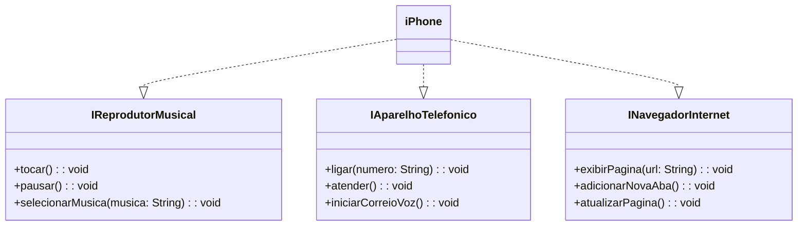

```mermaid
classDiagram
    class IReprodutorMusical {
        +tocar(): void
        +pausar(): void
        +selecionarMusica(musica: String): void
    }

    class IAparelhoTelefonico {
        +ligar(numero: String): void
        +atender(): void
        +iniciarCorreioVoz(): void
    }

    class INavegadorInternet {
        +exibirPagina(url: String): void
        +adicionarNovaAba(): void
        +atualizarPagina(): void
    }

    class iPhone {
    }

    iPhone ..|> IReprodutorMusical
    iPhone ..|> IAparelhoTelefonico
    iPhone ..|> INavegadorInternet
```
